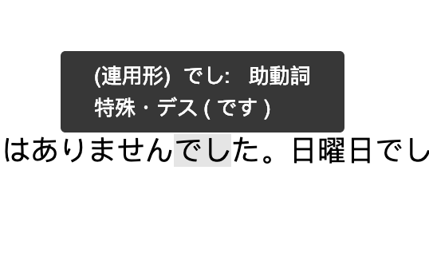

# An interactive note for New Japanese Concise Tutorial

[Online Demo](https://new-japanese-concise-tutorial-interactive-dpkjjsuhyq.now.sh)

## Feature

### Hover Information

- symbol definition (conjugated form, 活用形)
- current symbol
- symbol type (Part Of Speech, 词类, 品詞)
- generics (POS detail, 品詞細分類)
- overload reason (conjugated type, 几段动词, 活用型)
- original form without overload (basic form, 基本形)

### Intellisense

- syntax around a symbol (助词用法、动词用法等等)
- symbol property (活用形、几段动词、基本型、词类等基本概念)
- fixed collocation (句型、固定搭配)
- translation

## Technology

This project demonstrates basic usage of SoLiD POD (Linked Data Platform) and plugin architecture of SlateJS.

### SoLiD POD

#### List Files

In `src/store/texts.ts`, it uses `comunicaEngine` to load file list on a POD with `GraphQL`.

Texts was uploaded to [solid.authing.cn](https://new-japanese-concise-tutorial.solid.authing.cn/public/textbook/).

#### Search Related Knowledges

Fixed collocations and translation about text "です" are stored as triple on SoLiD POD, and connects to other knowledge as a web. These knowledge are searched by SPARQL and loaded as a list of Intellisense.

### SlateJS

`slate-mark-parsed` is a plugin that use provided parser (in this demo, [nlcst-parse-japanese](https://github.com/azu/nlp-pattern-match/blob/master/packages/nlcst-parse-japanese/README.md)) to get Natural Language Concrete Syntax Tree, and generate Slate Marks on the document.

`slate-mark-tooltip` consumes Slate Marks on a document, and provide VSCode style tooltip.
